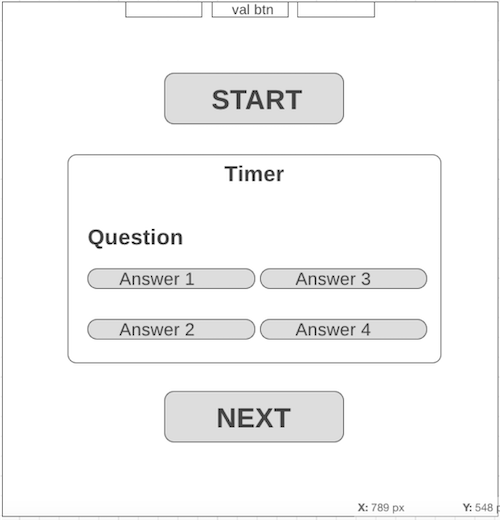

# Project Development Strategy

##  `state-js-Quiz`

### Description

This is a collaborative HTML, CSS and JavaScript project. It consists of single dynamic webpage and logic JS functions with the appropriate handlers and listener using state management.  

It could be useful to boost team-developing skills, to practice JavaScript, HTML and CSS3 frameworks.

It could be used as a set of easy to understand state management in JavaScript.

## Wireframe

<!-- include a wireframe for your project in this repository, and display it here -->

<!-- wireframe.cc is a good site for getting started with wireframes -->

  

## 0. Set-Up

__A User can see my initial repository and live demo__

### Repo 

> On this step the project repo was generated from template [w3-validation-template](https://github.com/HackYourFutureBelgium/state-project-js-quiz)

 Steps:

- Generate repo from template
- Turn on GitHub Pages
- Written initial, basic README
- Development-strategy file created

## 1. intro

 *assigned to Harun*
 
  
  - generate repository called **state-js-Quiz**
  - Create project board
  -  Assign issues 

## 2. HTML- CSS

*assigned to Ogla*

 On this step entire UI was set up. So the user can see a styled web page with a set of buttons each of which will be linked with JS function handler.

Steps:

- A new repo branch `html-css` was created.
- HTML markup was developed.
- CSS styling was added.
- The GitHub pull request was reviewed by reviewers and the branch was merged to the `master` branch.
 

## 3. Add Question js

*assigned to Ogla*

- Add-Question is developed on a branch called `Add-Question`

- On this step user can read the questions and select the answer.

    
### JS

- The new repo branch `Add-Question` was generated perspectively. 
- The questions with the variants of answers was added like as array with objects.
- The accuracy of answers (correct or wrong) was defined with pairs key-value `correct: true/ false`. 
- PR was raised, reviewed by two assigned reviewers and the branch
  was merged to the `master` branch.

## 4. write logic , view function 

*assigned to Harun*

- Developed on a branch called ` logic`

- Developed on a branch called ` view`

### JS

- The new repo branch `logic` and `view` were generated perspectively. 
- The core logic functions were developed
- An appropriate handlers were developed to use the functions interactively.
- PR was raised, reviewed by two assigned reviewers and the branch
  was merged to the `master` branch.
  

## 5. listener , Handler and README.md

*assigned to Hazem*

- Developed on a branch called `listener`
- - Developed on a branch called ` handler`

- Developed on a branch called `Readme`
- README file was completed in the separate branch which was reviewed and merged to the master.

### JS

- The new repo branch `listener` and `Readme`was generated perspectively. 
- The core logic functions were developed
- An appropriate handlers were developed to use the functions interactively.
- PR was raised, reviewed by two assigned reviewers and the branch
  was merged to the `master` branch.

## Finishing Touches
*assigned to Yana*

- W3C code validation made
- All bugs and errors were fixed

REF.
-  [makeareadme.com](https://www.makeareadme.com/)

-  [bulldogjob](https://bulldogjob.com/news/449-how-to-write-a-good-readme-for-your-github-project)

-  [meakaakka](https://medium.com/@meakaakka/a-beginners-guide-to-writing-a-kickass-readme-7ac01da88ab3)

- Validate code to check for any last mistakes
